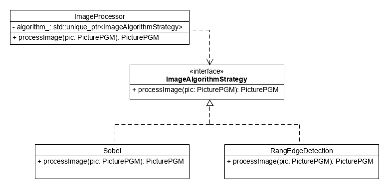

# C++ Image Edge Extraction Library

This program implements a collection of edge extraction algorithms that can be applied to PGM converted images.
As examples, two different edge extraction methods are implemented: Sobel and edge extraction using rank methods. 

## Software Architecture

The architecture is essentially based on the Strategy Software Design Pattern and thus covers the following requirements: 
* Easy addition of new algorithms
* Exchange of algorithms at runtime
* Simple and uniform interface for different edge extraction algorithms in the client code 

The following is the core idea of the program's architecture in UML notation. 
The UML diagram shows the strategy pattern applied to the program. 
It does not show all complete classes along with all attributes and methods of the program. 

